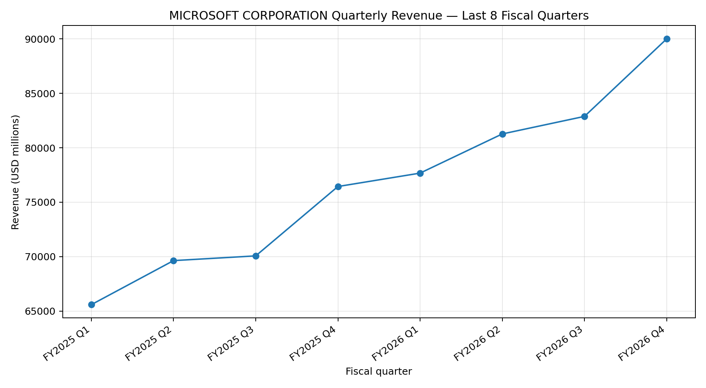

# SEC Revenue Scraper & Visualization

A Python-based financial data scraping and visualization project that retrieves company information and revenue data from the **U.S. Securities and Exchange Commission (SEC)**.

The application dynamically accepts a **company name or stock ticker**, retrieves the corresponding SEC CIK, extracts revenue data from SEC XBRL Company Facts, calculates quarterly revenue, and generates a visualization of the **latest eight fiscal quarters**.

---

## Features

- Search for a company using its name or stock ticker
- Automatically retrieve the company's SEC CIK
- Retrieve SEC Company Facts through the SEC XBRL API
- Automatically identify the appropriate revenue XBRL tag
- Extract revenue from `10-Q` and `10-K` filings
- Calculate standalone quarterly revenue
- Calculate Q4 revenue when standalone Q4 data is not directly available
- Dynamically detect available fiscal years
- Automatically retrieve the latest 8 fiscal quarters
- Convert revenue from USD to millions
- Generate a quarterly revenue trend chart
- Modular Python project structure
- Error handling for missing company or revenue data

---

## Project Structure

```text
sec-revenue-scraper/
│
├── src/
│   ├── sec_api.py
│   ├── revenue.py
│   └── chart.py
│
├── main.py
├── requirements.txt
└── README.md
```

### File Description

| File | Description |
|---|---|
| `main.py` | Main application workflow |
| `src/sec_api.py` | Handles SEC API requests and company/CIK lookup |
| `src/revenue.py` | Handles revenue extraction and quarterly calculations |
| `src/chart.py` | Generates the revenue visualization |
| `requirements.txt` | Python dependencies |
| `README.md` | Project documentation |

---

## How It Works

The application follows this workflow:

```text
User Input
    │
    ▼
Company Name / Ticker
    │
    ▼
SEC Company Ticker Lookup
    │
    ▼
Company CIK
    │
    ▼
SEC Company Facts API
    │
    ▼
Find Revenue XBRL Tag
    │
    ▼
Extract 10-Q / 10-K Revenue Data
    │
    ▼
Calculate Quarterly Revenue
    │
    ▼
Calculate Q4 when necessary
    │
    ▼
Sort Fiscal Quarters
    │
    ▼
Get Latest 8 Quarters
    │
    ▼
Convert USD → Millions
    │
    ▼
Generate Revenue Chart
```

---

## Data Source

This project uses publicly available financial data from the **U.S. Securities and Exchange Commission (SEC)**.

### SEC Company Facts API

https://data.sec.gov/api/xbrl/companyfacts/

### SEC Company Ticker Reference

https://www.sec.gov/files/company_tickers.json

The SEC Company Facts API provides structured XBRL data from company filings submitted through EDGAR.

---

## Requirements

- Python 3.9+
- Internet connection
- SEC API access
- A valid SEC `User-Agent` containing application information and contact information

---

## Installation

### 1. Clone the repository

```bash
git clone https://github.com/rnlandicho-ph/rl-sec-revenue-scraper.git
```

### 2. Navigate to the project

```bash
cd sec-revenue-scraper
```

### 3. Install dependencies

```bash
pip install -r requirements.txt
```

---

## Usage

Run the application from the project root:

```bash
python main.py
```

The program will prompt for a company name or ticker:

```text
Enter company name or ticker:
```

### Example: Using a Stock Ticker

```text
Enter company name or ticker: AAPL
```

Example output:

```text
CIK found: 0000320193

Company: Apple Inc.

Revenue tag: RevenueFromContractWithCustomerExcludingAssessedTax
```

### Example: Using a Company Name

```text
Enter company name or ticker: Apple
```

The application searches the SEC company ticker reference and automatically identifies the corresponding CIK.

Other examples:

```text
MSFT
Microsoft
TSLA
Tesla
NVDA
NVIDIA
```

---

## Company Search Logic

The application supports three levels of company matching:

### 1. Exact Ticker Match

For example:

```text
AAPL
```

### 2. Exact Company Name Match

For example:

```text
Apple Inc.
```

### 3. Partial Company Name Match

For example:

```text
Apple
```

If multiple companies match the search term, the application displays the available matches and asks the user to select the appropriate company.

---

## Revenue Extraction

The application checks several commonly used SEC `us-gaap` revenue tags:

```python
possible_tags = [
    "RevenueFromContractWithCustomerExcludingAssessedTax",
    "Revenues",
    "SalesRevenueNet",
]
```

The first available tag is used for the revenue extraction process.

The application then retrieves revenue values reported in USD and filters the data to include relevant `10-Q` and `10-K` filings.

---

## Quarterly Revenue Calculation

### Q1–Q3

For standalone quarters, the application identifies `10-Q` filings with reporting periods of approximately **80–100 days**.

This helps distinguish standalone quarterly revenue from cumulative year-to-date revenue.

### Q4

Standalone Q4 revenue is calculated using:

```text
Q4 Revenue = Annual Revenue - Nine-Month YTD Revenue
```

For example:

```text
Annual Revenue       = $400B
Nine-Month Revenue   = $300B
Q4 Revenue           = $100B
```

This approach allows the application to derive Q4 revenue when the SEC data does not directly provide a standalone Q4 value.

---

## Dynamic Fiscal Quarters

The application does not hardcode specific fiscal years.

Instead, it reads the fiscal years available in the SEC data:

```python
fiscal_years = (
    raw["fy"]
    .dropna()
    .unique()
)
```

It then processes the available fiscal quarters and sorts them chronologically.

Finally, the latest 8 quarters are selected:

```python
df = df.tail(
    number_of_quarters
)
```

This means the application can continue working as new financial filings become available without manually updating the fiscal years.

---

## Data Transformation

Revenue values retrieved from the SEC are reported in USD.

The application converts the values to millions:

```python
df["revenue_millions"] = (
    df["revenue"] / 1_000_000
)
```

The final dataset contains information such as:

| Quarter | Revenue |
|---|---:|
| FY2024 Q4 | Revenue in USD millions |
| FY2025 Q1 | Revenue in USD millions |
| FY2025 Q2 | Revenue in USD millions |
| FY2025 Q3 | Revenue in USD millions |
| FY2025 Q4 | Revenue in USD millions |
| FY2026 Q1 | Revenue in USD millions |
| FY2026 Q2 | Revenue in USD millions |
| FY2026 Q3 | Revenue in USD millions |

---

## Example Output

```text
Final revenue data:

  quarter       revenue_millions
  FY2024 Q4     XXXXX.XX
  FY2025 Q1     XXXXX.XX
  FY2025 Q2     XXXXX.XX
  FY2025 Q3     XXXXX.XX
  FY2025 Q4     XXXXX.XX
  FY2026 Q1     XXXXX.XX
  FY2026 Q2     XXXXX.XX
  FY2026 Q3     XXXXX.XX
```

The application also generates a chart:

```text
latest_8_quarters_revenue.png
```

---

## Sample Visualization

```markdown

```

The chart visualizes the company's quarterly revenue trend across the latest eight fiscal quarters.

---

## Technologies Used

- **Python**
- **Requests** – HTTP requests to SEC APIs
- **Pandas** – Data processing and transformation
- **Matplotlib** – Data visualization
- **SEC EDGAR / XBRL API** – Financial data source

---

## Key Learning Outcomes

This project demonstrates practical experience with:

- REST API consumption
- JSON data extraction
- Financial data scraping
- SEC EDGAR and XBRL data
- Dynamic company lookup
- CIK identification
- Pandas DataFrame manipulation
- Data filtering and transformation
- Fiscal period handling
- Cumulative vs. standalone financial data
- Revenue calculations
- Data visualization
- Python modularization
- Error handling

---

## Future Improvements

The following enhancements are planned:

- [ ] Add automated unit tests using `pytest`
- [ ] Add API mocking for test scenarios
- [ ] Add integration tests
- [ ] Add logging
- [ ] Add CSV export
- [ ] Add Excel export
- [ ] Support multiple companies in a single execution
- [ ] Add command-line arguments
- [ ] Add additional financial metrics such as Net Income and EPS
- [ ] Add interactive charts
- [ ] Build a Streamlit dashboard
- [ ] Add GitHub Actions for CI/CD
- [ ] Improve company search and validation
- [ ] Add configuration management for SEC API settings

---

## Disclaimer

This project is intended for **educational and portfolio purposes**.

Financial data is retrieved from publicly available SEC filings. This project does not provide financial advice or investment recommendations.

---

## Author

**Roy Landicho**

QA Automation Engineer

**Skills demonstrated in this project:**

`Python` · `API Automation` · `Web Scraping` · `Data Processing` · `Pandas` · `REST APIs` · `XBRL` · `Data Visualization`